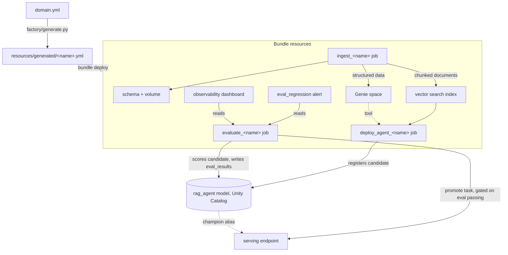

# agent-factory

A Databricks Declarative Automation Bundle that turns a small metadata file describing a knowledge domain (`domain.yml`) into a fully deployed, governed, evaluated pair of AI agents: a Genie agent over structured tables, and a RAG agent over documents with vector search, promotion gates and rollback. Write one `domain.yml`, add your data, and get working agents in your workspace.

See `docs/DESIGN.md` for the full architecture and reasoning behind every design decision, and `docs/PLAN.md` for build progress and every real bug found while building it.

## Architecture



A failed `evaluate_<name>` run blocks `promote`: the champion alias and the serving endpoint stay on the last version that actually passed, via a Databricks job task dependency, not application logic. See `docs/DESIGN.md` section 8 and `docs/PLAN.md` phase 3 notes.

## Quickstart

Roughly 20 minutes against a Databricks workspace with Unity Catalog (Free Edition works; see the caveats in `docs/PLAN.md` phase 0 notes: one workspace, no service principals, so CI/CD in `docs/AUTH.md` needs a paid workspace).

```bash
git clone https://github.com/stephen-a-nicholson/agent-factory
cd agent-factory
uv sync

databricks auth login --host <your-workspace-url> --profile agent-factory-dev
# Create a Unity Catalog catalog named agent_factory_dev via the UI first
# if your workspace needs one (Catalog > Create Catalog); see
# resources/core/shared.yml for why the bundle does not manage this itself.

databricks bundle validate -t dev -p agent-factory-dev
databricks bundle deploy -t dev -p agent-factory-dev
databricks bundle run -t dev ingest_f1 -p agent-factory-dev
```

That deploys and ingests the f1 example domain (Formula 1 results and FIA regulations). Ask it a question in the Databricks Playground once `deploy_agent_f1` has also run, or query the `f1_genie` Genie space directly. To start your own domain instead of editing `domains/f1/`:

```bash
databricks bundle init https://github.com/stephen-a-nicholson/agent-factory
```

This scaffolds a fresh copy of the whole repository (f1 kept as a working example, plus an empty `domains/<your-domain>/domain.yml` to fill in) into a new directory. See the generated project's own `docs/PLAN.md` for a phase-by-phase checklist covering the rest.

## The domain contract

`domains/<name>/domain.yml` is the only file a consumer has to write; everything else is derived by `factory/generate.py`. Full annotated reference: `docs/DESIGN.md` section 3. Summary:

| Block | Required | Produces |
|---|---|---|
| `structured` | yes | Unity Catalog tables, loaded from Parquet by `ingest_<name>` |
| `documents` | no | A volume, downloaded/parsed/chunked documents, a vector search index |
| `genie` | no | A Genie space over the structured tables, plus a benchmark eval job |
| `rag` | no | A RAG agent (`ResponsesAgent`) served on a model serving endpoint, with retrieval over `documents` and, optionally, the Genie space as a tool; an evaluate+promote job; a regression alert; an observability dashboard |

`factory/schema.py` is the Pydantic model behind this table; `domains/domain.schema.json` (exported from it) gives editors inline validation on `domain.yml`.

## Bundle quality gates

`gates/` is a standalone Python package that checks a Databricks Asset Bundle's resolved configuration against a fixed set of rules before it is allowed to deploy: no all-purpose clusters, required tags present, resource naming conventions, `test`/`prod` targets not left in development mode, no `permissions` block on a Genie space (a known platform limitation, see `CLAUDE.md`), vector search indexes `TRIGGERED` outside prod, no secret-shaped values in the resolved config, every job has a matching test file, serving endpoints scale to zero outside prod, and every domain with a RAG agent has a promotion threshold configured. See `docs/DESIGN.md` section 7 for the full rule table and the reasoning behind each one.

### Running the gates locally

```bash
uv sync
databricks bundle validate -t dev   # confirms auth and bundle shape first
uv run python -m gates.run --target dev
```

`gates.run` invokes `databricks bundle validate -t <target> -o json` (and, best-effort, `databricks bundle plan -t <target> -o json`) itself, so it needs a working Databricks CLI profile or `DATABRICKS_HOST`/`DATABRICKS_TOKEN` in the environment, the same as any other `databricks bundle` command. Exits non-zero if any rule reports a fail-severity finding; warn-severity findings are printed but do not fail the run. Pass `--output json` for machine-readable output, or `--config`/`--plan` to check a pre-captured JSON file instead of invoking the CLI (used by `tests/gates/`).

### Using the gates from another repository

The gates are also exposed as a composite GitHub Action, so a different bundle project can use them without vendoring this repository's Python:

```yaml
- uses: stephen-a-nicholson/agent-factory/.github/actions/bundle-gates@main
  with:
    target: test
```

The calling workflow is responsible for Databricks authentication before this step runs (an OIDC login step, or `DATABRICKS_HOST`/`DATABRICKS_TOKEN` secrets) and for checking out a copy of this repository's `gates/` package and `pyproject.toml` (the action installs `uv` and the Databricks CLI itself). See `.github/actions/bundle-gates/action.yml` for the full set of inputs.

### Adding a rule

A rule is a `gates.models.Rule` subclass under `gates/rules/` with a `name` and a `check(config, plan) -> list[Finding]` method, registered in `gates/rules/__init__.py`'s `ALL_RULES`. Add a passing case (checked against `tests/gates/fixtures/pass_config.json`, a real resolved dev bundle config with identifying details redacted) and a small, targeted failing fixture under `tests/gates/fixtures/`, per CLAUDE.md.

## CI/CD

`.github/workflows/pr.yml`/`main.yml`/`prod.yml`/`rollback.yml` implement the promotion flow described in `docs/DESIGN.md` section 6: PR checks, deploy-and-evaluate on merge to `test`, an approval-gated promotion to `prod`, and a rollback workflow. They need GitHub OIDC federated to a Databricks service principal per target; see `docs/AUTH.md` for setup, and its note on why this does not work on Databricks Free Edition.

## Contributing

See `CONTRIBUTING.md`.

## Licence

MIT, see `LICENSE`.
